# Question 1
Mark the correct statements about geospatial data

a. Surface phenomena can be specified by a series of longitude, latitude and height.
b. Point phenomena are termed one-dimensional
c. Surface phenomena are termed three-dimensional.
d. Examples of area phenomena are cities, and streets.

Correct: a

# Question 2:
Which color scales are appropriate to communicate which information? 

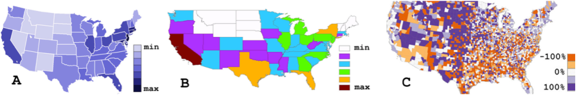

a. Map C is best suited to communicate the bettering or worsening of average income per county since last year
b. Map B is best suited to communicate population per square mile per state
c. Map A is best suited to communicate the bettering or worsening of average income per state since last year
d. Map A is best suited to communicate population per square mile per state

Correct: a,d

# Question 3:
Map projections are concerned with mapping the positions on the globe (sphere) to positions on the screen (flat surface). 

a. Azimuthal projections do not preserve the direction from a central point.
b. In cone projections the degrees of longitude and latitude are usually orthogonal to each other.
c. Conformal projections do not retain local angles on each point of a map correctly.
d. Conformal projection does preserve shapes.

Correct: b,d

# Question 4:
Mark the correct statements regarding text visualisation.

a. ThemeRiver (stream graph) is a visualization of thematic changes in a document collection over time.
b. The semantic level of text representation deals with identifying and tagging each token's function inside the sentence.
c. Text visualization is useful to compare patterns in text documents.
d. Word clouds are visualizations of term frequencies as well as their context.

Correct: a,c

# Question 5:
Mark the correct statements

a. Choropleth maps communicate the geographical distribution of the represented statistical value better than cartograms.
b. Cartograms are based on the assumption that the mapped attribute is uniformly distributed in the geographical region.
c. Cartograms distort the geography according to the displayed statistical value.

Correct: Unsure

# Question 6:
Concerning the aesthetics for dynamic visualization of graphs, mark the true sentences.

a. Concerning scalability, it only should be addressed for vertices and edges.
b. "Temporal aliases" do not impact significantly the quality of the layout.
c. "Reducing cognitive load" means reducing the amount of information the user has to keep in mind during the visualization of the graph.
d. Is preferable to preserve the mental map in the design of a dynamic network visualization method.

Correct: c,d

# Question 7:
A force-directed layout algorithm

a. models the graph after a physical system
b. is a method to reorder rows and columns of a matrix
c. is a graph-drawing method for node-link diagrams
d. is used to compute the colours of a heatmap
e. includes an energy maximization algorithm

Correct: a,c

# Question 8:
When designing a node-link graph visualization, particular attention has to be put on how to visualize the edges. Mark the correct sentences.

a. Polyline edges with multiple bends per edge can be used, but the number of bends should be minimized.
b. Curved approaches, such as Lombardi drawings, are usually preferred by the users even if they do not provide an advantage in any observed task.
c. In the directed case, when arrows are used to indicate the direction, they should not overlap with other edges or arrow heads.
d. Straight line node-link representations allow bends to reduce the number of crossings in the layout.

Correct: a,c

# Question 9:
A treemap

a. is a non-space-filling visualization method
b. is used to visualize hierarchies
c. can be squarified
d. can be nested
e. is used to visualize vegetation in a geographic area

Correct: b,c,d

# Question 10:
Which of the following visual encodings for hierarchies satisfy the following description?

Features:
- Hierarchy visualized via parent-child relationship
- Layout techniques include "Layered" and "Radial" approaches
- No cycles

PROs:
- Intuitive
- Well-known
- Good at giving an overview of the data

CONs
- Large structures might not fit a single view
- Aspect ratio

a. Treemap
b. Node-Link (trees)
c. Indentation
d. Sunbursts
e. Icicle trees

Correct: b

# Question 11:

[!Q11](Resources/Q11_1.png)

a. shows different visual representations depending on the color-coding chosen by the user.
b. relies solely on geometric zooming.
c. shows different visual representations depending on the zoom level chosen by the user and the available space for the visualization.
d. allows users to choose between a large scope (i.e., zooming out and seeing an overview of the big picture) or a more detailed view (i.e., zooming in and seing all details about a limited range of the data).

Correct: c,d

# Question 12:
How does the use of Focus+Context techniques impact usability?

a. overview+detail and fisheye interfaces are beneficial for specific tasks
b. overview+detail and zooming interfaces impact users' performance negatively
c. Focus+Context techniques are easy to follow and can be used without prior knowledge
d. the effectiveness of Focus+Context techniques depends on the users' tasks and goals

Correct: a,d

# Question 13:
What levels of the Info-Vis Reference Model are influenced by dynamic querying (with real time feedback)?

a. Visual Mappings
b. Visual Structures
c. Data Transformations
d. Data Tables
e. Views
f. View Transformations
g. Raw Data

Correct: Unsure

# Question 14:
Interaction modeling is employed to ...

a. ... validate effectiveness and user guidance of different interaction approaches.
b. ... capture requirements the system can be developed and evaluated against.
c. ... demonstrate interactions and tasks to users

Correct: a,b

# Question 15: 
Coordinated Multiple View systems ...

a. use two or more distinct views to support the investigation of a single conceptual entity
b. combine different visualization techniques and apply them on different data representations
c. use color-coding for trend detection
d. can not be supported by brushing & linking techniques
e. always support semantic zooming
f. are often supported by brushing & linking techniques

Correct: a,b,f

# Question 16:
Tamara Munzner: The nested model of visualization design and validation captures 

a. data/task abstraction
b. domain situation
c. patterns characteristics
d. search functionality
e. algorithm
f. visual encoding/interaction idiom
g. images properties

Correct: a,b,e,f

# Question 17:
InfoVis Reference Model: User interaction can feed back into ...

a. data transformation
b. table structure
c. visual mapping
d. text generation
e. image manipulation
f. view transformation

Correct: a,c,f

# Question 18:
The first action in the "Knowledge Crystallization Loop" is  ...

a. ... archive huge amount of data
b. ... forage for data
c. ... visualize data

Correct: b

# Question 19:
The visualization design triangle [Miksch & Aigner 2014] specifies ...

a. user
b. data
c. software
d. task
e. environment
f. hardware

Correct: a,b,d

# Question 20:
Anscombe's Quartet illustrates

a. random variables, different graphs
b. high level goals, correct measures
c. same statistics, different graphs

Correct: c

# Question 21:
Chernoff Faces

a. are suited to communicate complex data effectively
b. their features are likely to be perceived equally strong
c. are suspected to convey emotions
d. encode multiple data values with different graphical features

Correct: c,d

# Question 22:
Glyph or icon based techniques
(Figure: example of a glyph: The Time Annotation Glyph represents temporal constraints of a medical treatment plan -- ESS: earliest starting shift, LSS: latest starting shift, EFS: earliest finishing shift, LFS: latest finishing shift, MaxDu: maximum duration, MinDu: minimum duration)

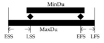

Wählen Sie eine oder mehrere Antworten:
a. are composed of graphical primitives
b. cannot represent multiple data values at once
c. do not represent one meaning as a whole but encode multiple data values

Correct: a,c

# Question 23:
Parallel Coordinates

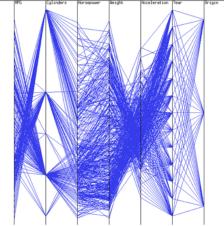

a. are better suited to visualize complex relations between two dimensions than scatterplots
b. re-ordering of the axes can reveal relations between two data dimensions
c. are usually arranged in a matrix to enable the visualization of multiple dimensions
d. represent each data dimension on one of multiple parallel axes

Correct: b,d 

# Question 24:
Pixel-Based Techniques

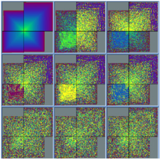

a. represent a data item by (at least) one pixel
b. are suited for low-dimensional data sets only
c. value ranges of attributes are mapped to a color map

Correct: a,c

# Question 25:
"Semantic depth of field" (SDOF)

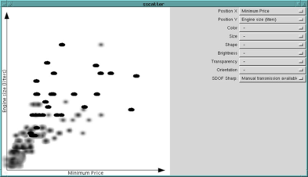

a. is good at visually communicating lots of different quantitative values
b. can be used to visually represent an additional data dimension in scatterplots
c. blurs data items based on their relevance

Correct: b,c

# Question 26:
Visual perception is...

a. a sequential process from eye to brain (bottom-up).
b. a combination of bottom-up and top-down processes.
c. a sequential process from brain to eye (top-down).

Correct: b

# Question 27:
The examples shown in the image are:

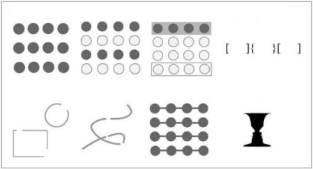

a. pre-attentive attributes
b. visual variables
c. visualization techniques
d. Gestalt principles

Correct: d

# Question 28:
The examples shown in the image are:

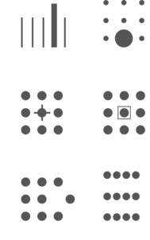

a. pre-attentive attributes
b. visual variables
c. Gestalt principles
d. visualization techniques

Correct: a

# Question 29:
Along which scale are T-Shirt sizes measured?

a. ordinal
b. quantitative - interval
c. nominal
d. quantitative - ratio

Correct: a

# Question 30:
Which of the following statements are correct?

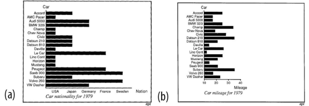

a. a is not expressive, b is expressive
b. a and b are both expressive
c. a is equally expressive than b, but b is more effective

Correct: a

# Question 31:
Which of the following statements about mapping time to space are correct?

a. mapping of time to visual features
b. well suited for following trends and movements
c. direct comparison of parameters between different points in time is possible
d. not well suited for analytic and explorative tasks

Correct: a,c

# Question 32:
Which of the following statements about the visual mapping of time are correct

a. animation (time to time) mapping supports to follow trends and movements
b. animation (time to time) mapping is the simplest mapping
c. static (time to space) mapping is well suited for explorative tasks
d. static (time to space) mapping support direct comparison
e. animation (time to time) mapping is well suited for explorative tasks

Correct: a,c,d

# Question 33:
For modelling time-oriented data, possible viewpoints are:

a. branching
b. cyclic
c. multiple perspectives
d. ordered
e. interval-based

Correct: a,c,d

# Question 34:
The shown techniques are well suited to represent:

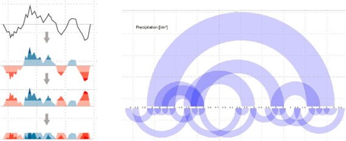
 
a. univariate data
b. multivariate data
c. cyclic time
d. time instant
e. linear time

Correct: a,d,e

# Questionn 35:
The shown technique is well suited to represent:

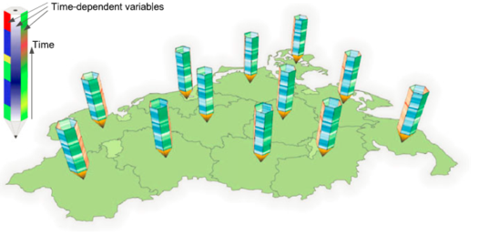

a. time instant
b. cyclic time
c. multivariate data
d. spatial
e. univariate data

Correct: a,c,d

# Question 36:
For data aggregation and data summary representations, which statements are correct?

a. Scatterplots of 2 dimensional data allow to confirm expected patterns.
b. Summary statistics of 2 dimensional data (mean, variance, correlation) are always different for different datasets. 
c. Box-plots as summary representation show enough detail to distinguish different raw data characteristics. 
d. Violin-plots as summary representation show more details about the structure as box-plots.

Correct: a,d

# Question 37:
According to the design study methodology (Sedlmair et al. 2012), when does a visualization design study offer a good solution for a given problem?

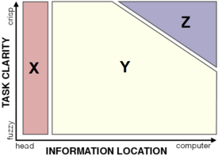

a. Area "X": all the required information is in the head of the user
b. Area "Y": either some of the required information is in the head of the user, or the task is not defined in a very clear way, or both.
c. Area "Z": the required information is available to the computer and the task is defined in a clear way.

Correct: b

# Question 38:
Formative evaluation

a. is used for problem analysis.
b. describes assessment methods after the implementation phase.
c. describes assessment methods during analysis and design phases.

Correct: c

# Question 39:
The central questions of problem analysis are:

a. What kind of data are the users working with?
b. What will the development method for the implementation phase be?
c. What are the tasks of the users?
d. How many software developers and designers are needed?
e. Who are the users of the system?

Correct: a,c,e

# Question 40: 
What are the main benefits of user-centered design/human-centered aspects?

a. systems get more complex and the discomfort is increased.
b. product quality, aesthetics, and impact are reduced.
c. productivity of users is usually improved.
d. training and support costs are reduced.

Correct: c,d 

# Question 41:
Components of Visual  Analytics: Assign the correct terms to A, B, and C (in red letters)

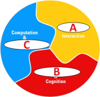

a. Process Mining
b. Visualization
c. Human Perception
d. Evaluation
e. Workflow Management
f. Mining

Correct: b,c,f

# Question 42:
Selected goals of Visual Analytics are designing and creating methods to enable users to ...

a. detect the expected and discover the unexpected
b. render realistic images in an expressive way
c. synthesize information and derive insight from massive, dynamic, ambiguous, and often conflicting data

Correct: a,c

# Question 43:
Guidance is ...

a. a computer-assisted process that aims to harmonize heterogeneous information sources
b. a computer-assisted process that aims to ease data quality exploration
c. a computer-assisted process that aims to actively resolve a knowledge gap encountered by users during an interactive Visual Analytics session

Correct: c

# Question 44:
EVA interlinks ...

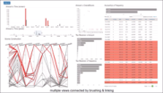

a. heatmaps, parallel coordinates, scatter plots, networks, maps, and time lines
b. maps, line chart, parallel coordinates, scatter plot, row charts, and networks
c. bar chart, line chart, parallel coordinates, scatter plot, row charts, and a table

Correct: c

# Question 45:
Visual Analytics – Process [Keim, et al. 2008]: Assign the correct terms to A and B (in red letters)

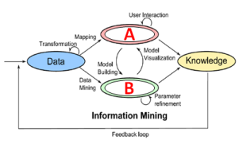

a. Information Retrieval
b. Model
c. Visualization
d. Machine Learning

Correct: b,c